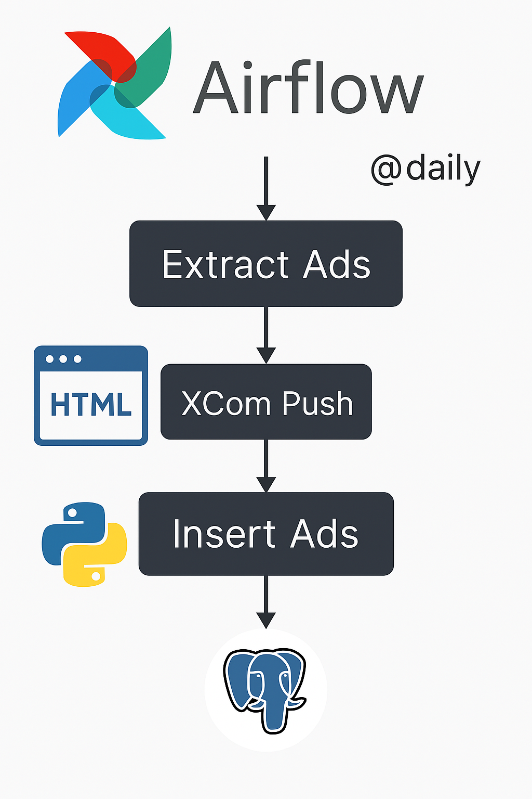

{\rtf1\ansi\ansicpg1252\cocoartf2821
\cocoatextscaling0\cocoaplatform0{\fonttbl\f0\fswiss\fcharset0 Helvetica;}
{\colortbl;\red255\green255\blue255;}
{\*\expandedcolortbl;;}
\paperw11900\paperh16840\margl1440\margr1440\vieww11520\viewh8400\viewkind0
\pard\tx566\tx1133\tx1700\tx2267\tx2834\tx3401\tx3968\tx4535\tx5102\tx5669\tx6236\tx6803\pardirnatural\partightenfactor0

\f0\fs24 \cf0 # \uc0\u55356 \u57312  Ikman.lk House Ads Data Pipeline with Apache Airflow\
\
\
\
This project automates the extraction of real estate advertisements from [ikman.lk](https://ikman.lk) for houses in Dehiwala using a web scraper. The data is then inserted into a PostgreSQL database through an **Apache Airflow** pipeline.\
\
---\
\
## \uc0\u55357 \u56960  Features\
\
- Extracts real-time ads from [ikman.lk](https://ikman.lk/en/ads/dehiwala/houses-for-sale)\
- Parses data with BeautifulSoup (title, bedrooms, bathrooms, location, price)\
- Inserts cleaned data into a PostgreSQL table\
- Daily scheduled DAG using Apache Airflow\
- Handles duplicate entries gracefully using `ON CONFLICT`\
\
---\
\
## \uc0\u55357 \u57056 \u65039  Technologies Used\
\
- [Apache Airflow](https://airflow.apache.org/)\
- [PostgreSQL](https://www.postgresql.org/)\
- [BeautifulSoup4](https://www.crummy.com/software/BeautifulSoup/)\
- [Pandas](https://pandas.pydata.org/)\
- Python 3\
\
---\
\
## \uc0\u55357 \u56567  Architecture\
\
\
\
> **Data Flow**: Web Scraping \uc0\u8594  XCom Push \u8594  PostgreSQL Insert \u8594  DAG Scheduler\
\
---\
\
## \uc0\u55357 \u56513  Project Structure\
\
```bash\
ikman-house-ads-pipeline/\
\uc0\u9500 \u9472 \u9472  dags/\
\uc0\u9474    \u9492 \u9472 \u9472  dag_with_ikman_house_ads.py   # Airflow DAG script\
\uc0\u9500 \u9472 \u9472  README.md                         # You're reading this\
\uc0\u9500 \u9472 \u9472  requirements.txt                  # All dependencies\
\uc0\u9492 \u9472 \u9472  assets/\
    \uc0\u9500 \u9472 \u9472  airflow_pipeline.png          # Architecture diagram\
    \uc0\u9492 \u9472 \u9472  ikman_logo.png                # Ikman.lk or custom project logo\
}